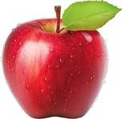

# Image Filter Lab (SP13)

**Signal Processing Project: Image Smoothing and Sharpening**

A lightweight, interactive web application built with Python and OpenCV to demonstrate fundamental 2D signal processing concepts. This application allows users to upload an image and instantly apply spatial filters (Mean, Gaussian, and Laplacian) to observe how matrix convolution affects visual data.

---

## 🛠️ Tech Stack
* **Backend:** Python, Flask, OpenCV (`cv2`), NumPy
* **Frontend:** HTML5, CSS3 (Flexbox)
* **Architecture:** Client-Server model

---

## 🚀 Features
* **Grayscale Conversion:** Automatically simplifies 3-channel color images into 1-channel arrays for processing.
* **Low-Pass Filtering (Blurring):**
  * **Mean Filter:** Uniform averaging for basic smoothing.
  * **Gaussian Filter:** Bell-curve weighted averaging for natural, photographic blurring.
* **High-Pass Filtering (Edge Detection):**
  * **Laplacian Filter:** 2nd derivative spatial operator. Includes both an "Edge Map" mode and a "Sharpened" mode.
* **Dynamic Kernel Sizes:** Users can adjust the convolution matrix size anywhere from `3x3` up to `99x99`.
* **Smart Caching:** Process different filters on the same image without needing to re-upload the file every time.

---

## 💻 Installation & Setup Guide

Follow these simple steps to run the application on your local machine.

### 1. Prerequisites
Make sure you have **Python** installed on your computer. You can download it from [python.org](https://www.python.org/).

### 2. Install Dependencies
Open your terminal (or Command Prompt) and run the following command to install the required Python libraries:

```bash
pip install flask opencv-python numpy


Run the Application
In your terminal, navigate to your project folder and run the app:

python app.py

Once the server is running, open your web browser and go to:
👉 http://127.0.0.1:5000

🖼️ Usage & Sample Input
Open the web app in your browser.

Upload a test image.



Select your desired Kernel Size (must be an odd number, e.g., 3, 5, 15).

Choose the Laplacian Mode (Sharpened or Edge Map).

Click Apply Filters.

Scroll down to view and download your results!

🎓 Author Details
Name: Kartik Vinod Thombare

Roll Number: ES23F3000531

Course/Project: SP13, Signal Processing

Institute: Indian Institute of Technology Madras (BS Electronic Systems)